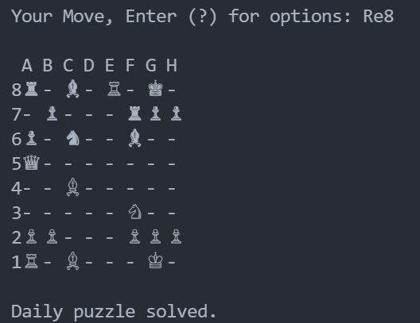

# Chess Game in C

 <!-- Optional: Include a screenshot of your game -->

## Overview

This is a command-line-based chess game developed in C using the [Raylib](https://www.raylib.com/) graphics library. The game aims to provide a classic chess experience with the basic rules of chess implemented. The project is an educational exercise in game development, bitboard manipulation, and utilizing a graphics library in C.

## Table of Contents

- [Features](#features)
- [Prerequisites](#prerequisites)
- [Getting Started](#getting-started)
  - [Clone the Repository](#clone-the-repository)
  - [Build the Game](#build-the-game)
  - [Run the Game](#run-the-game)
- [How to Play](#how-to-play)
- [Code Structure](#code-structure)
- [Roadmap](#roadmap)
- [Contributing](#contributing)
- [Acknowledgments](#acknowledgments)

## Features

- **Classic Chess Rules**: Supports all standard chess moves, including castling, en passant, and pawn promotion.
- **Bitboard Representation**: Efficient board representation using bitboards for fast move generation and position evaluation.
- **Graphical Interface**: Basic graphical interface using Raylib to display the chessboard and pieces.
- **Move Validation**: Ensures all moves are valid according to chess rules.
- **Game Modes**: Play against another human locally or watch the game being played by the computer (AI implementation is optional).

## Prerequisites

Before running the game, ensure you have the following installed:

- [Raylib](https://www.raylib.com/) (Installation required)
- A C compiler (like GCC or Clang)
- Make (if you're using the provided Makefile)

## Getting Started

### Clone the Repository

```sh
git clone https://github.com/awaisAhmed19/Chess.git
cd Chess
```

## Build the Game

If you're using the Makefile, simply run:

```sh
make
```

This will compile the source code and generate the executable.

If you're compiling manually, you can do so with:

```sh
gcc -o chess main.c bitboard.c board.c init.c hashKey.c
```

## Run the Game

After building the game, you can run it with:

```sh
./chess  # On Linux/Mac
chess.exe  # On Windows
```

## How to Play

- The game is played using standard chess rules.
- Use the mouse or keyboard to select and move pieces.
- The game will enforce move legality, so invalid moves are not allowed.
  Code Structure
- main.c: The main entry point for the game.
- bitboard.c: Handles the bitboard representation and operations.
- board.c: Manages the chessboard, including piece placement and move generation.
- init.c: Initializes game data, such as setting up the board and bitmasks.
- hashKey.c: Implements hashing for board positions.
- defs.h: Header file containing definitions and macros used across the project.

## Roadmap

- **AI Opponent**: Implement an AI to play against the human player.
- **Undo/Redo Functionality**: Allow players to undo and redo moves.
- **Save/Load Games**: Implement the ability to save and load game states.
- **Online Multiplayer**: Allow two players to play against each other over a network.

## Contributing

Contributions are welcome! Please fork the repository and submit a pull request if you have any improvements or new features you'd like to add.

## Acknowledgments

- Raylib for the graphics library.
- The chess programming community for valuable resources on bitboards and chess engine development.
